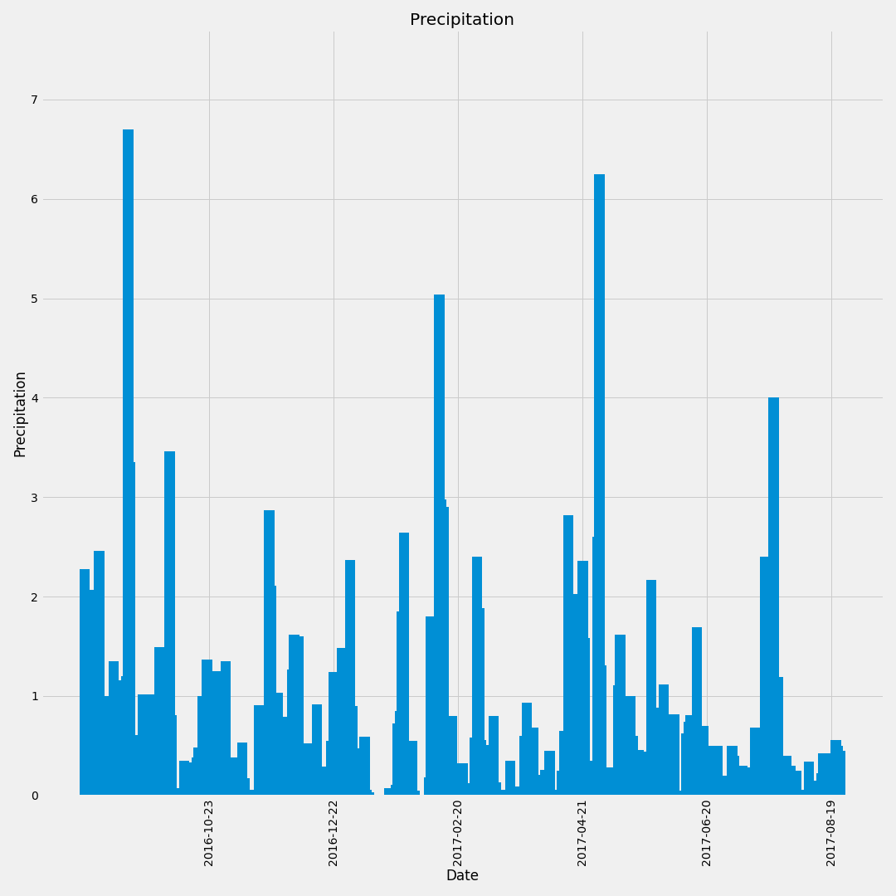

This projects uses python and SQL to plan out our vacation to Hawaii. Using Python the data was cleaned and then uploaded into an SQL database. THen an SQL lite file was created allowing us to easily access and query the data. Python was again used so that we could find the average rain and the average temp while we where going to be in Hawaii. 

